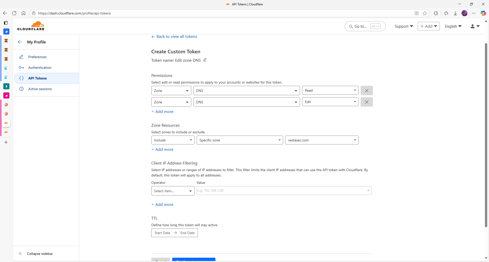
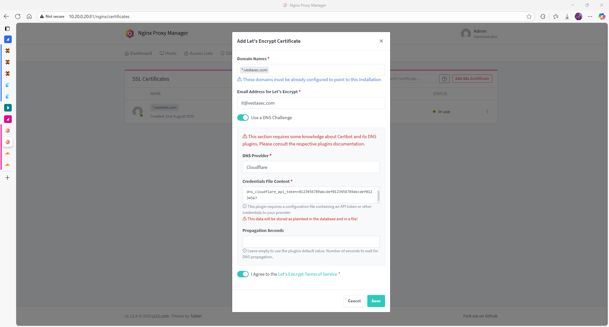
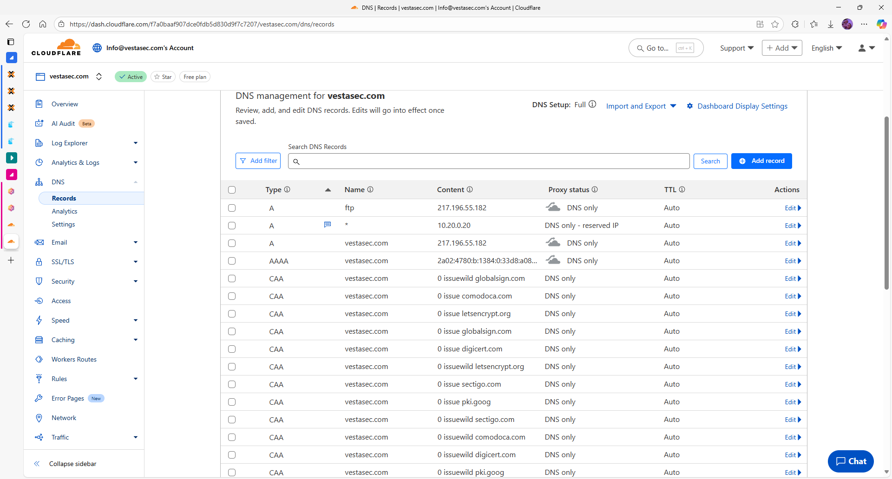
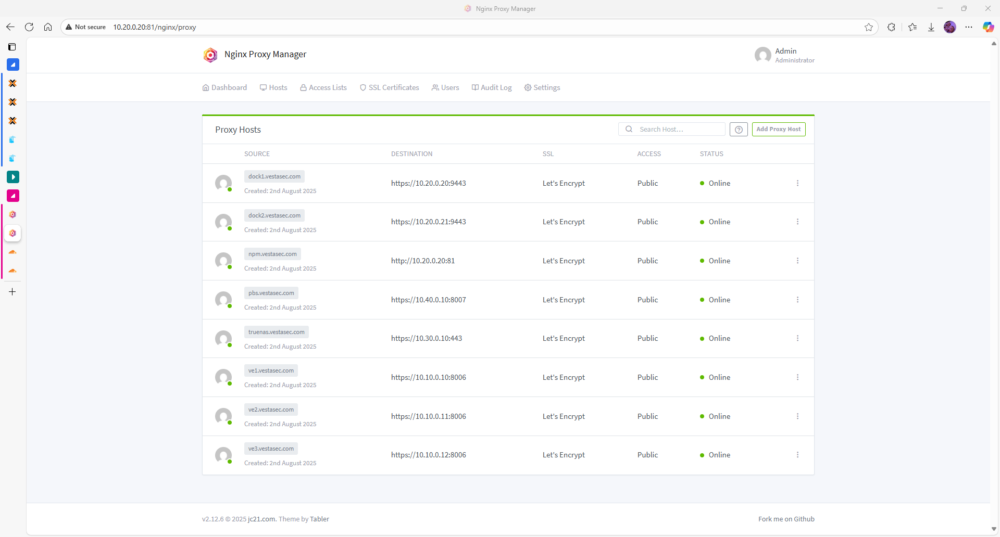

# Configuration of Nginx Proxy Manager (latest)

## Introduction

This guide covers the initial and advanced configuration options available through the web GUI of Nginx Proxy Manager. After deployment, most tasks can be managed from the browser.

## First Login

1. Go to: `http://<IP_of_dock1>:81`
2. Login with default credentials:
   - Email: `admin@example.com`
   - Password: `changeme`
3. You will be required to:
   - Set a new password
   - Change the admin email address

## Change Admin Email & Password

- Navigate to the **User** icon (top-right) → **Edit Account**
- Update:
  - Email address (e.g., `admin@lab.local`)
  - Password
- Save changes and re-login if needed

## Add a Proxy Host

1. Go to **Hosts → Proxy Hosts**
2. Click **Add Proxy Host**
3. Fill in:
   - **Domain Names**: e.g. `app.vesta.local`
   - **Forward Hostname/IP**: internal IP of target service
   - **Forward Port**: 80 or 443
   - Optionally enable:
     - Block common exploits
     - Websockets support
4. Under **SSL** tab:
   - Enable SSL
   - Request a Let's Encrypt certificate
   - Agree to terms
   - Optionally enable HTTP/2 and HSTS
5. Click **Save**

---

## Setup Wildcard SSL with Cloudflare (Recommended)

To issue wildcard certificates using Let's Encrypt and Cloudflare DNS challenge:

### 1. Create an API Token in Cloudflare

Go to [https://dash.cloudflare.com/profile/api-tokens](https://dash.cloudflare.com/profile/api-tokens)

- Choose: **Edit Zone DNS**
- Permissions:
  - Zone → DNS → Read
  - Zone → DNS → Edit
- Zone Resources:
  - Include → Specific zone → `vestasec.com`
- Copy and save the generated token.



---

### 2. Create wildcard certificate in NPM

1. Go to **SSL Certificates → Add SSL Certificate**
2. Enter `*.vestasec.com` as domain
3. Use DNS Challenge → Select **Cloudflare**
4. Paste credentials:

```
dns_cloudflare_api_token=your_token_here
```

5. Accept Let's Encrypt terms and click **Save**



---

### 3. Setup DNS A Record

- In Cloudflare DNS settings:
  - Create `A` record for `*` → points to public IP or internal IP (`10.20.0.20`)
  - Set proxy mode to **DNS Only** during cert issuance



---

### 4. Add Proxy Hosts

Once cert is issued, you can add proxy hosts like:

- `dock1.vestasec.com`
- `ve1.vestasec.com`

Each will automatically use the wildcard certificate.



---

## SSL Certificate Management

- All requested certs will appear under **SSL Certificates**
- You can:
  - Reissue or delete certificates
  - Create self-signed certificates if needed
  - Import existing certificates manually

## Access & Logs

| Location               | Description                            |
|------------------------|----------------------------------------|
| `/data/logs/`          | Contains access and error logs         |
| Web GUI → Logs         | Filter per host or global              |
| Docker logs            | Use `docker logs -f npm` for real-time |

## Backup and Restore

- Go to **Settings → Backup**
- Download configuration
- Restore from file during new deployments

## Best Practices

- Use subdomains for each service (e.g., `grafana.lab.local`)
- Set automatic SSL renewal (default is enabled)
- Avoid exposing the admin panel to the public internet

## Next Steps

- [Networking →](network.md)
- [Features →](features.md)
