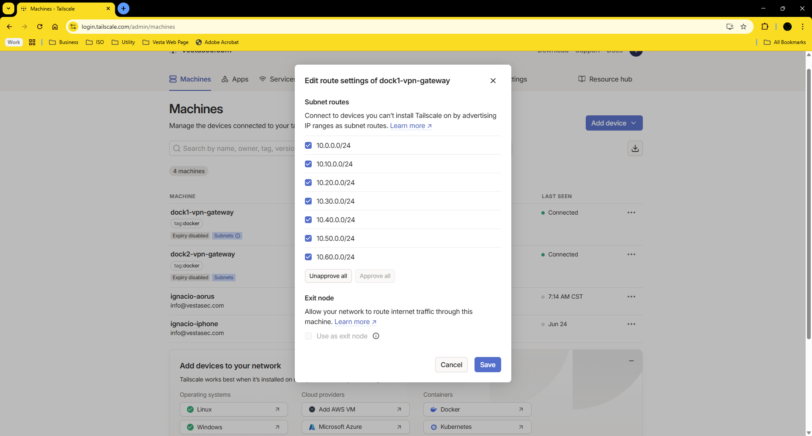

# Tailscale Subnet Router Configuration

## Introduction

This guide explains how to configure a Docker container running Tailscale as a **subnet router**, allowing remote access to internal lab networks through Tailscale’s mesh VPN.

## Prerequisites

- A running Tailscale container with host networking
- Preapproved reusable auth key
- Reachable internal VLANs via the host
- Access to the Tailscale admin panel

## Step 1 – Advertise internal subnets

Edit your `docker-compose.yml` and add `--advertise-routes` to `TS_EXTRA_ARGS`:

```yaml
environment:
  - TS_AUTHKEY=tskey-xxxxxxxxxxxxxxxx
  - TS_EXTRA_ARGS=--hostname=dock1 --advertise-routes=10.0.0.0/24,10.10.0.0/24,10.20.0.0/24,10.30.0.0/24,10.40.0.0/24,10.50.0.0/24,10.60.0.0/24
```

> You can include multiple comma-separated CIDRs.

## Step 2 – Restart the container

```bash
docker-compose up -d
```

## Step 3 – Approve routes in the admin panel

1. Go to https://login.tailscale.com/admin/machines
2. Locate the node `dock1`
3. Click **"Enable subnet routes"**
4. Make sure the route indicator turns green



## Step 4 – Test from another node

From a remote Tailscale device:

```bash
tailscale status
ping 10.10.0.1
ssh user@10.10.0.50
```

> If successful, you are reaching your lab's internal LAN over Tailscale.

## Enable IP forwarding on the host

```bash
sysctl -w net.ipv4.ip_forward=1
```

Make it persistent:

```bash
echo "net.ipv4.ip_forward = 1" >> /etc/sysctl.conf
```

## VLANs and advertised subnets

| Subnet         | Interface       | Suggested Purpose                                             |
|----------------|------------------|----------------------------------------------------------------|
| `10.0.0.0/24`  | `ether1`         | Primary network and internet gateway                          |
| `10.10.0.0/24` | `vlan10-mgmt`    | Management: Proxmox, Ceph, MikroTik, monitoring               |
| `10.20.0.0/24` | `vlan20-svc`     | Internal services: containers, APIs, databases                |
| `10.30.0.0/24` | `vlan30-stor`    | Storage: TrueNAS, MinIO, Nextcloud                            |
| `10.40.0.0/24` | `vlan40-bak`     | Backups and snapshots: PBS, Veeam, Restic, Borg               |
| `10.50.0.0/24` | `vlan50-iot`     | IoT devices: cameras, sensors, automation                     |
| `10.60.0.0/24` | `vlan60-dmz`     | Public exposure: reverse proxies, VPN entrypoints             |
| `10.70.0.0/24` | `vlan70-guest`   | Guest Wi-Fi and isolated traffic                              |

## Validation and Tests

From inside the container:

```bash
tailscale status
ping 10.10.0.1
```

From a remote client:

```bash
ping 10.10.0.10
ssh user@10.20.0.5
```

## Common Issues

| Issue                             | Solution                                              |
|----------------------------------|-------------------------------------------------------|
| Routes not advertised            | Check TS_EXTRA_ARGS syntax                            |
| Cannot ping internal IPs         | Enable IP forwarding on host                          |
| Traffic doesn't reach VLANs      | Check firewall rules or bridge config on `dock1`      |

## References

- [Installation →](installation.md)
- [Subnet Routing Docs](https://tailscale.com/kb/1019/subnets)
- [ACLs and Tagging](https://tailscale.com/kb/1151/acl-tags)
