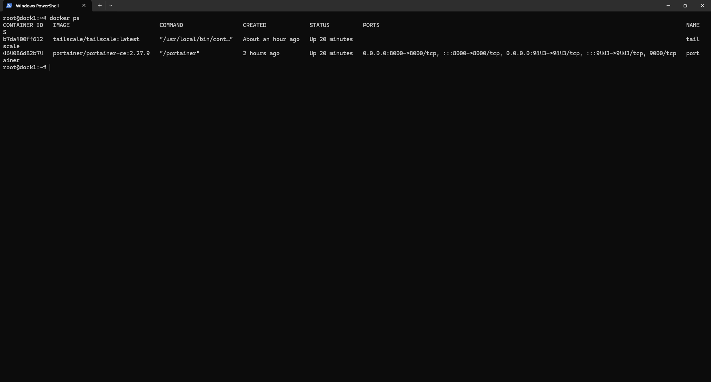
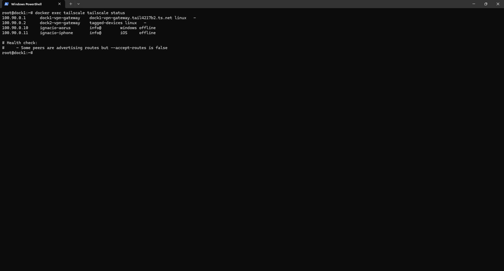
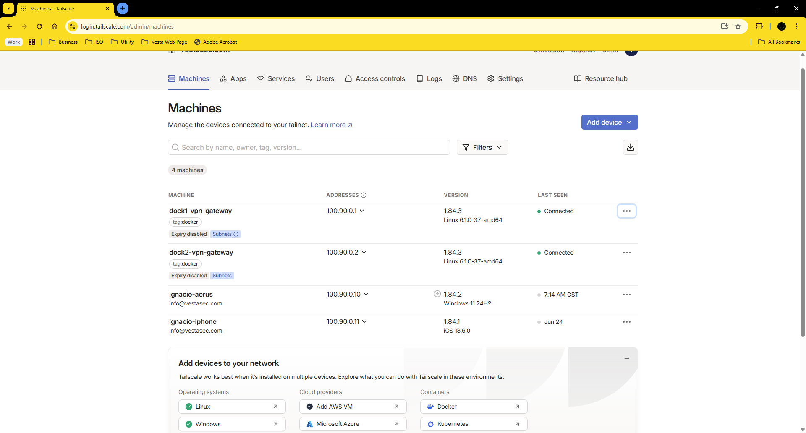

# Installation of Tailscale 1.84.3 (Docker)

## Introduction

This guide details how to install and run Tailscale 1.84.3 inside a Docker container on a Linux machine. This setup allows the container to act as a VPN client and optional subnet router for internal networks.

## Prerequisites

- Linux system with Docker and Docker Compose installed
- An active Tailscale account: https://tailscale.com
- A valid auth key (`tskey-...`) from the admin panel
- Access to `/dev/net/tun` and `CAP_NET_ADMIN` permissions
- UDP port 41641 allowed for outbound traffic
- Internal VLANs you want to advertise

## Step 1 – Create working directory

```bash
mkdir -p ~/tailscale-docker
cd ~/tailscale-docker
```

## Step 2 – Create docker-compose.yml

```yaml
version: '3.8'

services:
  tailscale:
    container_name: tailscale
    image: tailscale/tailscale:latest
    network_mode: "host"
    cap_add:
      - NET_ADMIN
      - SYS_MODULE
    volumes:
      - tailscale-var-lib:/var/lib/tailscale
      - /dev/net/tun:/dev/net/tun
    environment:
      - TS_AUTHKEY=tskey-xxxxxxxxxxxxxxxx
      - TS_EXTRA_ARGS=--hostname=dock1 --advertise-routes=10.0.0.0/24,10.10.0.0/24,10.20.0.0/24,10.30.0.0/24,10.40.0.0/24,10.50.0.0/24,10.60.0.0/24
    restart: unless-stopped

volumes:
  tailscale-var-lib:
```

> 💡 Generate your auth key from [admin/settings/authkeys](https://login.tailscale.com/admin/settings/authkeys). Recommended: mark it as **Reusable** and **Preauthorized**.

## Step 3 – Start the container

```bash
docker-compose up -d
```

This will pull the image and run the container with host networking and routing enabled.

## Step 4 – Check container status

```bash
docker ps

docker logs -f tailscale
docker exec -it tailscale tailscale status

```

## Admin Panel Tips


| Menu         | Action                  | Purpose                                 |
|--------------|--------------------------|------------------------------------------|
| Admin Panel  | Enable Subnet Routes     | Allow access to local lab networks       |
| Machines     | Check hostname           | Confirm container is registered as `dock1` |
| Auth Keys    | Create new key           | Automate deployments                     |

## Validation and Tests

- From another Tailscale node:

```bash
ping 100.x.x.x         # container IP
ping 10.10.0.10        # real LAN IP behind container
```

- From inside the container:

```bash
ping 10.10.0.1
tailscale status
```

## Common Issues

| Issue                              | Solution                                               |
|------------------------------------|--------------------------------------------------------|
| `No such container`                | Ensure `docker-compose up` ran successfully            |
| Node does not appear in the panel | Check if auth key is valid and preapproved             |
| Subnet access not working          | Approve routes in Admin Panel and enable IP forwarding |
| LAN ping fails                     | Ensure IP forwarding is enabled on host                |

## Next Steps

- [Advanced Configuration →](configuration.md)
- [Tailscale Docker Docs](https://tailscale.com/kb/1153/docker)
- [Admin Panel](https://login.tailscale.com/admin/machines)
