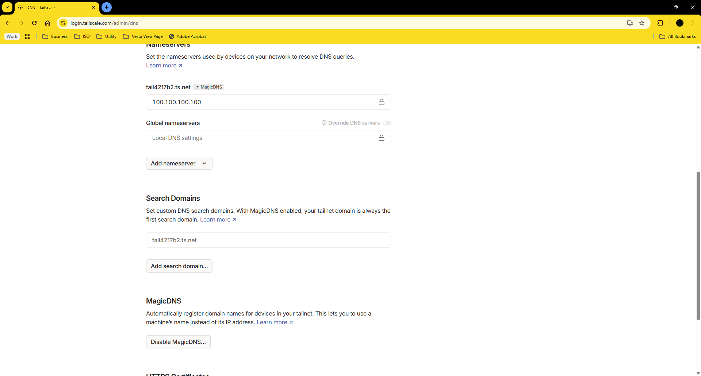

# Tailscale Networking (Docker)

## Introduction

This document explains how Tailscale integrates with the host network when running in a Docker container using `network_mode: host`, including ports used, NAT traversal behavior, and DNS handling.

## Required Ports

| Port  | Protocol | Purpose                                 |
|-------|----------|-----------------------------------------|
| 41641 | UDP      | Primary WireGuard peer-to-peer traffic  |
| 443   | TCP      | Control connection to coordination server |
| 53    | UDP      | DNS resolution if MagicDNS is enabled   |


> Note: Tailscale does not require incoming ports, but outbound UDP 41641 must be allowed.

## NAT Traversal

Tailscale supports advanced NAT traversal techniques:

- **UDP hole punching**
- **Fallback relaying via DERP servers**
- **Automatic IPv4/IPv6 detection**

This allows connectivity from networks behind firewalls, double NAT, or LTE providers, without manual port forwarding.

## MagicDNS

Tailscale supports internal DNS resolution using the `.ts.net` domain. When MagicDNS is enabled:

- Nodes can resolve each other by name
- You don't need to memorize IPs like `100.x.x.x`
- DNS config is pushed from the control panel

## Host Interfaces

Running with `network_mode: host` gives the container full access to host interfaces, including access to internal VLANs:

| Subnet         | Interface       | Suggested Purpose                                             |
|----------------|------------------|----------------------------------------------------------------|
| `10.0.0.0/24`  | `ether1`         | Primary network and internet gateway                          |
| `10.10.0.0/24` | `vlan10-mgmt`    | Management: Proxmox, Ceph, MikroTik, monitoring               |
| `10.20.0.0/24` | `vlan20-svc`     | Internal services: containers, APIs, databases                |
| `10.30.0.0/24` | `vlan30-stor`    | Storage: TrueNAS, MinIO, Nextcloud                            |
| `10.40.0.0/24` | `vlan40-bak`     | Backups and snapshots: PBS, Veeam, Restic, Borg               |
| `10.50.0.0/24` | `vlan50-iot`     | IoT devices: cameras, sensors, automation                     |
| `10.60.0.0/24` | `vlan60-dmz`     | Public exposure: reverse proxies, VPN entrypoints             |
| `10.70.0.0/24` | `vlan70-guest`   | Guest Wi-Fi and isolated traffic                              |

## Diagnostics

Run the following from inside the container:

```bash
tailscale netcheck
tailscale status
ping 10.10.0.1
```

## Common Issues

| Issue                    | Solution                                |
|--------------------------|-----------------------------------------|
| All traffic via DERP     | Likely UDP blocked; check firewall/NAT  |
| Can't resolve names      | Enable MagicDNS in control panel        |
| No subnet access         | Verify subnet routes are approved       |

## See Also

- [Configuration](configuration.md)
- [Features](features.md)
- [DERP status](https://login.tailscale.com/admin/debug)
